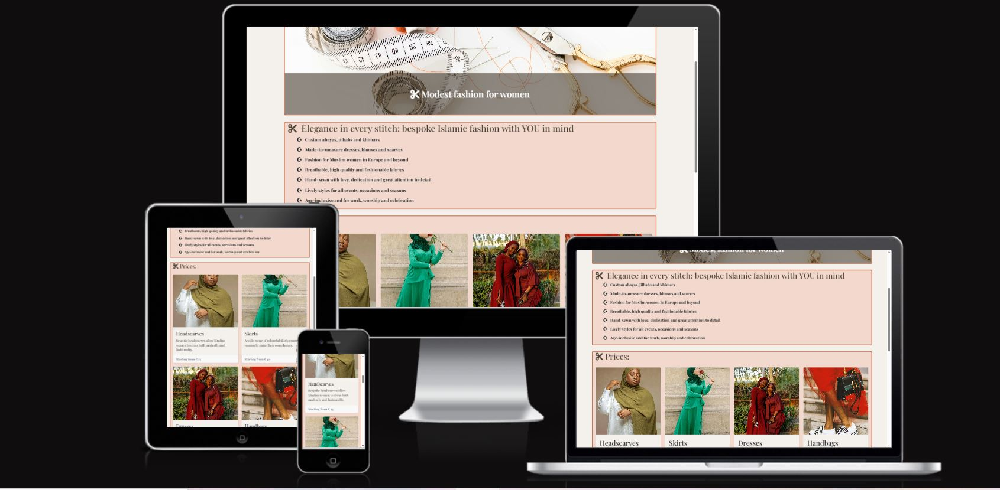
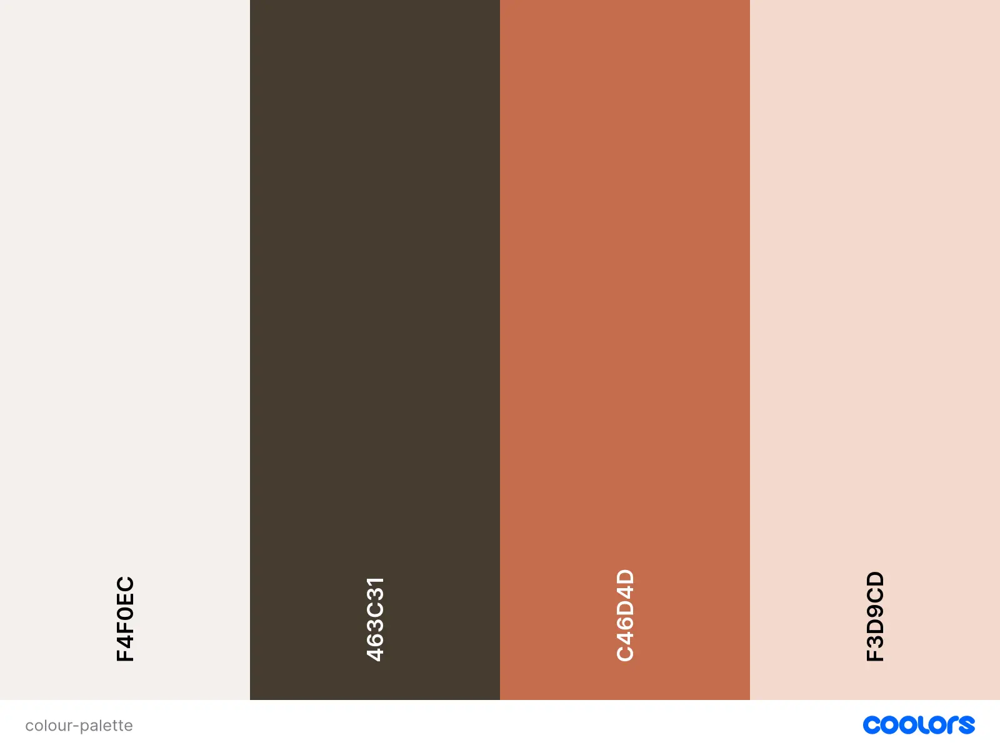
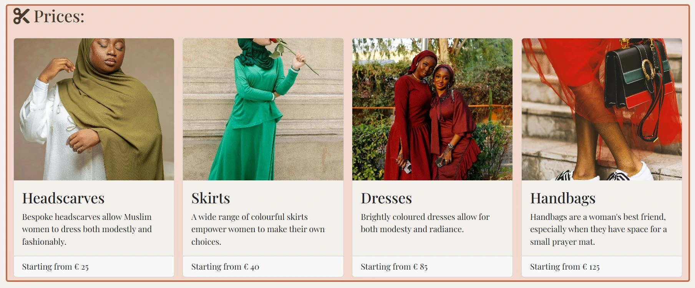

# Abeer ElAshry - Seamstress #

[Visit the live site](https://sascha-netizen.github.io/abeer-seamstress/)

## Project Abstract: ## 

As a teacher, cultural historian, and published author, I have spent much of my adult life engaged with Middle Eastern history, politics, and culture. After completing a PhD on English travellers in the Ottoman Empire during the seventeenth and eighteenth centuries, I moved to Egypt, where I worked as an English and history teacher at several international schools and taught myself conversational Arabic. A practicing Muslim myself, I have long been interested in how minorities navigate and negotiate space within host cultures that are not their own. For this milestone project in my web development course, I wanted to combine my project-based teaching approach, which is centered on solving real-world problems, with my Egyptian wife's passion for sewing. Rather than simply creating a website to demonstrate basic HTML and CSS skills, I chose to develop a prototype e-commerce portal designed to serve the needs of Muslim women living and working in Europe. This project serves as an initial step toward a career in internationalisation and localisation within web development.

## 1. Background Information ## 

The goal of this website for Abeer ElAshry is twofold – on the one hand, it functions as a virtual showroom for the finished products and services that are on offer. Visualising, categorising and tagging them with prices provides a clear structure of what customers can expect from the business. On the other, the website facilitates  customer contact and orders. Primary users are practicing Muslim women seeking modest fashion aligned with their religious values. Although a niche market in Europe, this segment values the bespoke work of a religiously inspired seamstress who caters to their specific needs. Local mosques, community centres and cultural events are likely hubs at which customers meet and exchange information about their fashion choices. Accordingly, a tailor-made website for a seamstress might be a literal blessing for practicing Muslims and their circles.

The contact form is the primary call to action (CTA), through which customers can reach out to Abeer for enquiries and orders. Given that bespoke services can be costly, direct contact is key for customer satisfaction, especially in a small market segment that is heavily reliant on personal contacts and networks. Also, a gallery showcasing sample work (handbags, blouses, dresses etc) support the CTA by demonstrating quality, style and individual choice. Abeer's biography lends a personal touch to the website and showcases her passion for her craft. Whilst the details in the biography are real, the testimonials are based on friends, family and acquaintances, whose personal details have been changed.

## 2. Purpose, Goals and User Information ##

Purpose: 'Abeer ElAshry - Modest fashion for Women' is an e-commerce portal that showcases bespoke fashion for Muslim women, combining user-centric design for a niche community in Europe with personal storytelling.

Primary Goals:
- Showcase bespoke modest fashion through a culturally sensitive e-commerce prototype.

- Facilitate customer engagement with a contact form that encourages inquiries and personalised service.

- Serve a niche audience — Muslim women in Europe — by aligning design and content with their values and everyday needs.

Secondary Goals:
- Demonstrate technical competence in HTML and CSS through a user-focused design that is appropriate for milestone-project one.

- Build toward a career in localisation/internationalisation, using this project as a foundational step into culturally adaptive web development.

User Stories (must have):
- As a practicing Muslim woman, I want to know about pricing so that I can make an informed choice about what I can afford in terms of bespoke modest fashion.

- As a practicing Muslim woman, I want to know about the experiences of past or existing clients so that I can make an informed choice about what I want to buy in terms of bespoke modest fashion.

- As a retailer selling halal products, I want to view the seamstresses work so that I can showcase her work in my shop and expand our common customer base.

User Story (should have):
- As the husband of a practicing Muslim woman, I want to know which services are on offer so that I can buy modest fashion for my wife.

User Story (could have):
- As a venue/local mosque, in which the local community both prays and hosts events, I want to learn about the seamstresses’ services so that I can explore potential avenues for cooperation and networking.

## 3. Design ##

As a hot desert country, Egypt's natural and cultural landscapes are dominated by warm earthen colours and hues. When I was working in Cairo, the country's president, Abdelfattah AlSisi, issued a decree about how to paint buildings. In January 2019, *The Guardian* even published [an article](https://www.theguardian.com/world/2019/jan/21/egypt-presidential-decree-buildings-unified-colour-scheme) about this rather unusual new rule, according to which urban buildings had to be painted in 'dusty' colours whereas coastal structures should reflect the sea's blue. Therefore, I decided to utilise both Egypt's obvious geophysical features and official government policy in my project by experimenting with a mix of earthen, brownish and terracotta colours.

The Colour Palette:  
I decided to compile my colour palette with [Coolors](https://coolors.co/f4f0ec-463c31-c46d4d-f3d9cd) because it is simple and handy: 

<table border="1" cellpadding="8" cellspacing="0" style="border-collapse: collapse; border: 1px solid #463c31;">
  <thead style="background-color: #f3d9cd; color: #463c31; font-weight: bold;">
    <tr>
      <th>Color Name</th>
      <th>Hex Code</th>
      <th>Usage Example</th>
    </tr>
  </thead>
  <tbody>
    <tr>
      <td>Primary Color</td>
      <td>#f4f0ec</td>
      <td>Body background, card body background</td>
    </tr>
    <tr>
      <td>Secondary Color</td>
      <td>#463c31</td>
      <td>Headings, navbar &amp; footer background</td>
    </tr>
    <tr>
      <td>Highlight Color</td>
      <td>#c46d4d</td>
      <td>Borders, hover effects</td>
    </tr>
    <tr>
      <td>Highlight Color Light</td>
      <td>#f3d9cd</td>
      <td>Section backgrounds</td>
      </tbody>
      </table> 

Typography:  
I wanted to choose warm fonts that are pleasing to the eye. My choice was lead by trial and error, and I pitted several fonts against one another until I settled on [Playfair Display](https://fonts.google.com/specimen/Playfair+Display) for headings and [Quicksand](https://fonts.google.com/specimen/Quicksand) for text. Both are from Google Fonts.

Images:  
I downloaded the favicon from [Flaticon.](https://www.flaticon.com/free-icon/sewing_3577865?term=sewing+machine&page=1&position=3&origin=search&related_id=3577865)

I downloaded the images for the Prices and Testimonials sections from [Pexels.](https://www.pexels.com/) In line with the website's Islamic theme, I chose aesthetically pleasing images that could potentially be integrated into a real-world e-commerce page.

All photos of the website's protagonist, Abeer ElAshry, are hers and reflect the biography outlined in the project.

Wireframes:  
I took a mobile-first approach and decided to create the wireframes manually, since I enjoy translating tangible objects into digital products. 

  
Wireframes – Mobile Screens

  

 

  
Wireframes – Desktop (Home)

  

 

  
Wireframes – Desktop (About Me)

  

 

  
Wireframes – Desktop (Contact)

  

 

## 4. Website Features ##

Here is an overview of general features that appear on each page: 

<table border="1">
  <thead>
    <tr>
      <th>Website Feature</th>
      <th>Display/Implementation</th>
    </tr>
  </thead>
  <tbody>
    <tr>
      <td>This is the navigation bar on small screens (tablet and smaller):</td>
      <td></td>
    </tr>
    <tr>
      <td>This is the navigation bar on big screens: </td>
      <td>  </td>
    </tr>
    <tr>
      <td>This is the footer on small screens (tablet and smaller): </td>
      <td> </td>
    </tr>
    <tr>
      <td>This is the footer on big screens: </td>
      <td>  </td>
    </tr>
  </tbody>
</table> 

## Homepage:  ##

The first section of the homepage consists of a hero image that clearly displays textual and pictorial elements in line with the website's overall narrative:  

 

The second section displays a a general list of pertinent sartorial items for Muslim women:

 

The third section displays prices for four different kinds of sartorial items: 

 

The fourth section displays testimonials of current clients:

 

